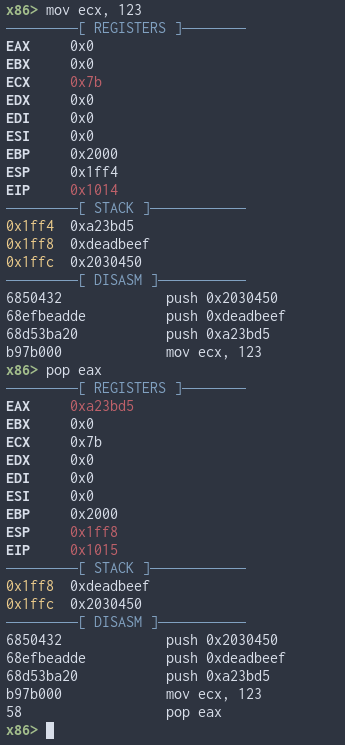

# 🍓Ttalgi
Ttalgi is a very basic assembly REPL written in Rust using [Unicorn](https://www.unicorn-engine.org/) and [Keystone](http://www.keystone-engine.org/).

Right now it only emulates the x86 32-bit architecture and needs a lot of work.

## 💾Installation

### Requirements

- Rust 1.38 and up
- [Unicorn](https://www.unicorn-engine.org/)
- [Keystone](http://www.keystone-engine.org/)


## ⚙️Building

```
$ git clone https://github.com/MartiGJ/ttalgi.git
$ cd ttalgi
$ cargo build
```

## 📝To Do

- Comment code
- Add more architectures
- Implement Unicorn and Keystone functions as part of Ttalgi
- Fix update_disasm so it doesn't need params
- Add addresses to print_disasm
- Implement return Result in main and get rid of all those unwraps

## 🖼️Example Images



## 🎓License

[MIT](LICENSE)

